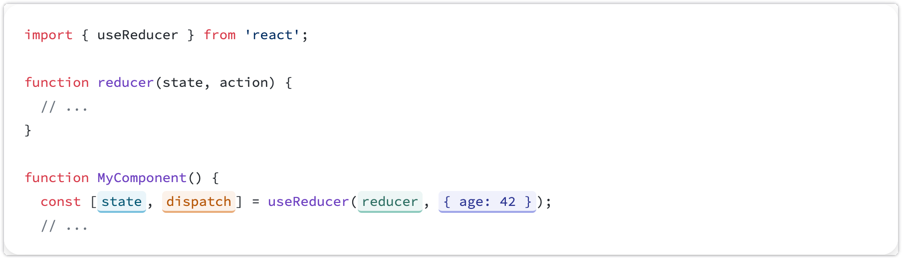

#### Promise

代表一个未来才会结束的操作（可能成功也可能失败），并允许为这两种结果分别指定回调函数

Promise一共存在三种状态：

- pending 进行中
- fulfilled 已成功
- rejected 已失败

e.g. 为了让外部代码可以用 `await` 或 `.then()` 的方式来调用IndexDB的API，将回调风格**封装成 Promise 风格**：

```typescript
return new Promise((resolve, reject) => {
  const request = store.get(sessionId);
  request.onsuccess = () => {
    resolve(request.result || null);
  };
  request.onerror = () => {
    reject(new Error(`获取会话失败: ${request.error?.message}`));
  };
});
```

Promise 构造函数接收一个函数，这个函数有两个参数：`resolve` 和 `reject`，分别用于“成功”或“失败”时的回调

### IndexDB

#### 错误处理

```typescript
db.onerror = (event) => {
  // 针对此数据库请求的所有错误的通用错误处理器！
  console.error(`数据库错误：${event.target.errorCode}`);
};
```

#### 创建与存储对象

```typescript
const dbName = "the_name";

const request = indexedDB.open(dbName, 2);

request.onerror = (event) => {
  // 错误处理
};
request.onupgradeneeded = (event) => {
  const db = event.target.result;

  // 创建一个对象存储来存储我们客户的相关信息，我们将“ssn”作为键路径
  // 因为 ssn 可以保证是不重复的——或至少在启动项目的会议上我们是这样被告知的。
  const objectStore = db.createObjectStore("customers", { keyPath: "ssn" });

  // 创建一个索引以通过姓名来搜索客户。名字可能会重复，所以我们不能使用 unique 索引。
  objectStore.createIndex("name", "name", { unique: false });

  // 使用邮箱建立索引，我们想确保客户的邮箱不会重复，所以我们使用 unique 索引。
  objectStore.createIndex("email", "email", { unique: true });

  // 使用事务的 oncomplete 事件确保在插入数据前对象存储已经创建完毕。
  objectStore.transaction.oncomplete = (event) => {
    // 将数据保存到新创建的对象存储中。
    const customerObjectStore = db
      .transaction("customers", "readwrite")
      .objectStore("customers");
    customerData.forEach((customer) => {
      customerObjectStore.add(customer);
    });
  };
};
```

> `onupgradeneeded` 是我们唯一可以修改数据库结构的地方——创建和删除对象存储，以及创建和修改索引

#### 使用索引

在 `onupgradeneeded`中创建了索引之后，就可以使用index：

```typescript
const index = objectStore.index("name");

index.get("Donna").onsuccess = (event) => {
  console.log(`Donna 的 SSN 是 ${event.target.result.ssn}`);
};
```

如果 `name`不是唯一的，name上述的查找将会找到 `name` 最小的对象

如果希望访问所有满足给定 `name` 的对象，就需要使用 **游标**

#### 使用键生成器

```typescript
// 打开 indexedDB。
const request = indexedDB.open(dbName, 3);

request.onupgradeneeded = (event) => {
  const db = event.target.result;

  // 创建另一个名为“names”的对象存储，并将 autoIncrement 标志设置为真。
  const objStore = db.createObjectStore("names", { autoIncrement: true });

  // 因为“names”对象存储拥有键生成器，所以它的键会自动生成。
  // 添加的记录将类似于：
  // 键：1 => 值："Bill"
  // 键：2 => 值："Donna"
  customerData.forEach((customer) => {
    objStore.add(customer.name);
  });
};
```

#### 操作数据

事务提供了3种模式：`readonly`、`readwrite` 和 `versionchange`。

- `versionchange`： 中才能改变数据库的schema与结构（index）
- 只有在 `readwrite` 事务中才能修改对象存储；

  ```typescript
  transaction(storeNames)
  transaction(storeNames, mode)
  transaction(storeNames, mode, options)
  ```

删除数据：

```typescript
const request = db
  .transaction(["customers"], "readwrite")
  .objectStore("customers")
  .delete("444-44-4444");
request.onsuccess = (event) => {
  // 删除成功！
};
```

获取数据：

```typescript
const transaction = db.transaction(["customers"]);
const objectStore = transaction.objectStore("customers");
const request = objectStore.get("444-44-4444");
request.onerror = (event) => {
  // 错误处理！
};
request.onsuccess = (event) => {
  // 对 request.result 做些操作！
  console.log(`SSN 444-44-4444 对应的名字是 ${request.result.name}`);
};
```

上述简单的查询也可以简写为：

```typescript
db
  .transaction("customers")
  .objectStore("customers")
  .get("444-44-4444").onsuccess = (event) => {
  console.log(`SSN 444-44-4444 对应的名字是 ${event.target.result.name}`);
};
```

更新记录：

> 也就是先读取，修改值后再 `put` 插入

```typescript
const objectStore = db
  .transaction(["customers"], "readwrite")
  .objectStore("customers");
const request = objectStore.get("444-44-4444");
request.onerror = (event) => {
  // 错误处理！
};
request.onsuccess = (event) => {
  // 获取我们想要更新的旧值
  const data = event.target.result;

  // 更新对象中你想修改的值
  data.age = 42;

  // 把更新过的对象放回数据库。
  const requestUpdate = objectStore.put(data);
  requestUpdate.onerror = (event) => {
    // 对错误进行处理
  };
  requestUpdate.onsuccess = (event) => {
    // 成功，数据已更新！
  };
};
```

#### 匹配字符

```
// 尝试使用正则表达式提取 JSON 字符串（从完整响应文本中提取有效 JSON）
const match = text.match(/```json\s*([\s\S]*?)\s*```/);
if( !match || !match[1]){
    throw new Error('未找到有效的JSON数据');
}

const jsonString = match[1];
const json = JSON.parse(jsonString);
```

### 使用自定义组件

#### snackbar

定义上下文:

```typescript
import { createContext, useContext, useState } from 'react';

type Severity = 'success' | 'info' | 'warning' | 'error';

interface SnackbarState {
  open: boolean;
  message: string;
  severity: Severity;
}

interface SnackbarContextType {
  snackbar: SnackbarState;
  showSnackbar: (message: string, severity: Severity) => void;
  hideSnackbar: () => void;
}

const SnackbarContext = createContext<SnackbarContextType>({
  snackbar: { open: false, message: '', severity: 'info' },
  showSnackbar: () => {},
  hideSnackbar: () => {},
});

export const SnackbarProvider = ({ children }: { children: React.ReactNode }) => {
  const [snackbar, setSnackbar] = useState<SnackbarState>({
    open: false,
    message: '',
    severity: 'info',
  });

  const showSnackbar = (message: string, severity: Severity = 'info') => {
    setSnackbar({ open: true, message, severity });
  };

  const hideSnackbar = () => {
    setSnackbar(prev => ({ ...prev, open: false }));
  };

  return (
    <SnackbarContext.Provider value={{ snackbar, showSnackbar, hideSnackbar }}>
      {children}
    </SnackbarContext.Provider>
  );
};

export const useSnackbar = () => useContext(SnackbarContext);
```

定义通用组件:

```typescript
import { Alert, Snackbar as MuiSnackbar } from '@mui/material';
import { useSnackbar } from '@/contexts/SnackbarContext';

export const GlobalSnackbar = () => {
  const { snackbar, hideSnackbar } = useSnackbar();

  return (
    <MuiSnackbar
      open={snackbar.open}
      autoHideDuration={3000}
      anchorOrigin={{ vertical: 'top', horizontal: 'center' }}
      onClose={hideSnackbar}
      sx = {{mt:4}}
    >
      <Alert
        onClose={hideSnackbar}
        severity={snackbar.severity}
        sx={{
          width: '100%',
          bgcolor: `var(--${snackbar.severity}-bg)`,
          color: 'var(--snackbar-text)',
          '& .MuiAlert-icon': {
            color: `var(--${snackbar.severity}-icon)`,
          }
        }}
      >
        {snackbar.message}
      </Alert>
    </MuiSnackbar>
  );
};
```

在 `globals.css`中设置css变量:

```typescript
  /* snack样式 */
  --success-bg: #d4edda;
  --success-icon: #2e7d32;

  --error-bg: #f8d7da;
  --error-icon: #c62828;

  --warning-bg: #fff3cd;
  --warning-icon: #ed6c02;

  --info-bg: #E5F6FD;
  --info-icon:#2C93D6;

  --snackbar-text: var(--secondary-text);

// 暗色模式下
[data-theme="dark"] {
	...
  
    /* snack样式 */
  --success-bg: #1e2d22;
  --success-icon: #81c784;

  --error-bg: #2c1c1c;
  --error-icon: #ef5350;

  --warning-bg: #2b2616;
  --warning-icon: #ffb74d;

  --info-bg: #1e2a32;
  --info-icon: #5dade2;

  --snackbar-text: var(--secondary-text);
}
```

由于全局都需要使用, 我们在 `layout`文件中将对应的 provider 放在最外层, 然后在所有文件中如此使用:

```typescript
// 导入
import { useSnackbar } from '@/contexts/SnackbarContext';

// 解析和使用
const { showSnackbar } = useSnackbar();
showSnackbar('操作成功', 'success'); // 支持'success'|'info'|'warning'|'error'
```

#### 处理展开/收起的逻辑

例如我们希望为 `quiz` 项设置展开/收起的功能, 我们可以为每个item设置 boolean的是否展开字段:

```typescript
export interface Quiz {
  id: string; // 唯一标识符，使用UUID格式
  name: string; // 题目名称，支持用户自定义或自动生成
  description: string; // 题目描述文本（来自er_quiz_generator的description字段）
  referenceAnswer: ERDiagramData; // 标准答案ER图数据（来自er_quiz_generator的erData字段）
  createdAt: number; // 创建时间戳
  updatedAt?: number; // 可选的更新时间戳
  expanded?: boolean; // 是否被展开查看
}
```

在对应的组件中, 设置一个包含了展开项item的 `quizId`(string类型)的集合:

```typescript
const [expandedQuizzes, setExpandedQuizzes] = useState<Set<string>>(new Set());
```

之后, 我们只需要在改变的时候切换对应 `quizId`是否在这个状态项中:

```typescript
// 切换单个题目的展开状态
  const toggleExpand = useCallback((quizId: string) => {
    setExpandedQuizzes(prev => {
      const newSet = new Set(prev);
      if (newSet.has(quizId)) {
        newSet.delete(quizId);
      } else {
        newSet.add(quizId);
      }
      return newSet;
    });
  }, []);
```

> 此处通过 `new Set(prev);` 拷贝了上一状态的Set, 然后针对传入的 `quizId`, 通过 `if-else` 将其状态置反(是否存在于Set中)

## ReactFlow

#### 自定义右键事件

- 在 ReactFlow 画布上监听 `onContextMenu` 事件

  - 阻止浏览器默认右键菜单显示

  ```typescript
  // 右键菜单状态接口
  interface ContextMenuState {
    isOpen: boolean;
    position: { x: number; y: number };
    flowPosition: { x: number; y: number };
  }
  
  // 右键菜单状态
  const [contextMenu, setContextMenu] = useState<ContextMenuState>({
    isOpen: false,
    position: { x: 0, y: 0 },
    flowPosition: { x: 0, y: 0 },
  });
  ```

**定义右键菜单处理：**

```typescript
 // 右键菜单处理函数
  const handleContextMenu = useCallback(
    (event: React.MouseEvent) => {
      event.preventDefault(); // 阻止浏览器默认的右键菜单

      // 将屏幕坐标转换为画布坐标
      const flowPosition = screenToFlowPosition({
        x: event.clientX,
        y: event.clientY,
      });

      setContextMenu({
        isOpen: true,
        position: { x: event.clientX, y: event.clientY },
        flowPosition, // 期望创建的节点位置
      });
    },
    [screenToFlowPosition]
  );
```

> 调用 `screenToFlowPosition` 将点击的位置信息转换为画布的位置信息

**在ReactFlow中监听右键事件：**

```typescript
<ReactFlow
...
onContextMenu = {handleContextMenu}
>
```

此时用户在画布的任何地方点击右键时，`handleContextMenu` 都会触发，从而设置 `isOpen`为 `true`来打开菜单栏并传递对应的位置信息

**设置菜单栏：**

```typescript
{/* 右键菜单 */}
      <Menu
        open={contextMenu.isOpen}
        onClose={handleCloseContextMenu}
        anchorReference='anchorPosition'
        anchorPosition={{
          top: contextMenu.position.y,
          left: contextMenu.position.x,
        }}
        transformOrigin={{
          vertical: "top",
          horizontal: "left",
        }}
        slotProps={{
          paper: {
            sx: {
              minWidth: 200,
              boxShadow: 3,
            },
          },
        }}
      >
        <MenuItem onClick={() => handleCreateNode("strong-entity")}>
          <ListItemIcon>
            <BorderAllIcon sx={{ color: "#448fd6" }} />
          </ListItemIcon>
          <ListItemText primary='添加强实体' />
        </MenuItem>
				...
     
      </Menu>
```

对应的 `handleCreateNode`实现：

```typescript
// 创建节点的处理函数
  const handleCreateNode = useCallback(
    async (nodeType: string) => {
      // 如果没有 Context，则不处理创建
      if (!contextMethods.addEntity || !contextMethods.addRelationship) {
        console.warn(
          "ERDiagram: Cannot create node, ERDiagramContext not available"
        );
        return;
      }

      try {
        // 根据节点类型创建相应的实体或关系
        if (nodeType === "strong-entity") {
          const newEntity = createDefaultEntity(contextMenu.flowPosition);
          await contextMethods.addEntity(newEntity);
          console.log("通过右键菜单创建新实体:", newEntity);
        } ...
      } catch (error) {
        console.error("右键菜单创建节点失败:", error);
      } finally {
        handleCloseContextMenu(); // 创建之后关闭Menu
      }
    },
    [contextMenu.flowPosition, contextMethods, handleCloseContextMenu]
  );
```

## Hooks

### useMemo

> 这种缓存返回值的方式也叫做 [记忆化(memoization)](https://en.wikipedia.org/wiki/Memoization)，这也是该 Hook 叫做 `useMemo` 的原因

```typescript
useMemo(calculateValue, dependencies)
```

- `calculateValue`：要缓存计算值的函数。它应该是一个没有任何参数的纯函数，并且可以返回任意类型。React 将会在首次渲染时调用该函数；在之后的渲染中，如果 `dependencies` 没有发生变化，React 将直接返回相同值
- `dependencies`：所有在 `calculateValue` 函数中使用的响应式变量组成的数组

#### 衡量计算开销

```typescript
console.time('filter array');
const visibleTodos = filterTodos(todos, tab);
console.timeEnd('filter array');
```

通过上述方式, 我们可以得到某个函数的执行时间. 并决定是否采取 `useMemo` 对其进行优化

```typescript
console.time('filter array');
const visibleTodos = useMemo(() => {
  return filterTodos(todos, tab); // 如果 todos 和 tab 都没有变化，那么将会跳过渲染。
}, [todos, tab]);
console.timeEnd('filter array');
```

一般来说, 对于粗糙的页面与转换, 我们没有必要使用 `useMemo`. 如果我们的程序更像是 **图像编辑器**. 并且大多数交互都是颗粒状的, 就有必要使用 `useMemo`

#### 防止频繁触发 `Effect`

在 `Effect`中使用变量, 每一个响应值都应该作为依赖:

```typescript
function ChatRoom({ roomId }) {
  const [message, setMessage] = useState('');

  const options = {
    serverUrl: 'https://localhost:1234',
    roomId: roomId
  }

  useEffect(() => {
  const connection = createConnection(options);
  connection.connect();
  return () => connection.disconnect();
}, [options]); // 🔴 问题：每次渲染这个依赖项都会发生改变
// ...
```

> 之所以每次渲染都会改变 `options`,  是因为每次渲染都会创建一个新的 `options`对象, 尽管内部的值可能没有发生变化, 但是对象的引用发生了变化. React 会认为 `options` 变了，从而重新执行 useEffect

因此, 对于上述问题, 我们需要用 `useMemo` 缓存 `options`:

```typescript
const options = useMemo(() => {
  return {
    serverUrl: 'https://localhost:1234',
    roomId: roomId
  };
}, [roomId]);
```

此时, 只有当 `roomId` 发生变化的时候才会生成新的对象, 否则复用上一次的引用.



React 的 useEffect 是通过浅比较依赖数组里的每一项来判断是否变化的。如果是基本类型（如 number、string、boolean），比较的是值；而对象比较的是**引用地址**。



### useReducer

> [link](https://zh-hans.react.dev/reference/react/useReducer)

```typescript
const [state, dispatch] = useReducer(reducer, initialArg, init?)
```

> An alternative to `useState`.
>
> `useReducer` is usually preferable to `useState` when you have complex state logic that involves multiple sub-values. It also lets you optimize performance for components that trigger deep updates because you can pass `dispatch` down instead of callbacks

i.e. `useReducer` 是 React 用来管理复杂 state 的 Hook

**什么是reducer函数**

`reducer` 是一个外部函数, 整合了组件所有的更新状态逻辑.

#### 在组件中使用



我们通过 `dispatch` 来传递操作的 `type` 以及额外的参数 (称之为 `action`)

e.g.

```typescript
function handleDeleteTask(taskId) {
  dispatch(
    // "action" 对象：
    {
      type: 'deleted',
      id: taskId,
    }
  );
}
```

每当我们调用 `dispatch` 函数的时候, `reducer` 函数就会接受当前的 `state` 以及 `dispatch` 提供的 `action`, 并通常利用 `action`中的 `type`字段来 **switch**: e.g.

```typescript
function reducer(state, action) {
  switch (action.type) {
    case 'incremented_age': {
      return {
        name: state.name,
        age: state.age + 1
      };
    }
    case 'changed_name': {
      return {
        name: action.nextName,
        age: state.age
      };
    }
  }
  throw Error('Unknown action: ' + action.type);
}
```

> 我们建议将每个 `case` 块包装到 `{` 和 `}` 花括号中，这样在不同 `case` 中声明的变量就不会互相冲突。

#### Immutability

React 推荐不可变数据（**Immutability**），也就是说，**每次状态变化都要返回一个新的对象，而不是直接修改原来的 state**

> 这样的设计是为了方便通过检测变化, 来调试、回溯和组件的重新渲染. (比如我们仅修改了state, 但是其引用没有发生变化, React无法确定组件的状态发生了变化)

鉴于上述的特性, 对于每个action的处理, 我们不应该直接操作当前的 `state` ,而是返回修改之后的新状态

e.g.

```typescript
function reducer(state, action) {
  switch (action.type) {
    case 'incremented_age': {
      // 🚩 不要像下面这样修改一个对象类型的 state：
      state.age = state.age + 1;
      return state;
    }
```

```typescript
function reducer(state, action) {
  switch (action.type) {
    case 'incremented_age': {
      // ✅ 正确的做法是返回新的对象
      return {
        ...state,
        age: state.age + 1
      };
    }
```

因此, 不要忘记返回修改属性之外的属性:

e.g.

```typescript
function reducer(state, action) {
  switch (action.type) {
    case 'incremented_age': {
      return {
        ...state, // 不要忘记复制之前的属性！
        age: state.age + 1
      };
    }
    // ...
```

#### 初始化函数与初始值

回顾定义:

```typescript
const [state, dispatch] = useReducer(reducer, initialArg, init?)
```

如果我们的 `initialArg` 是一个函数调用, 尽管只有第一次渲染时候会将结果赋值给 `state`, React还是会在每次渲染的时候重新调用该函数. 如果对应的计算成本很高, 我们就要考虑 **避免重新创建初始值** —— 通过第三个参数传入 **初始化函数**(函数本身, 而非调用返回值)

e.g.

```typescript
 const [state, dispatch] = useReducer(reducer, username, createInitialState);
```

#### Tips

- 每个 `action` 都描述一个单一的用户交互，即使它会引发数据的多个变化
- **reducer 必须是纯粹的**. 即当输入相同时，输出也是相同的。它们不应该包含异步请求、定时器或者任何副作用（对组件外部有影响的操作）. 同时应该以不可变值的方式去更新对象和数组;

## 其他

React 组件是常规的 JavaScript 函数，但 **组件的名称必须以大写字母开头**，否则它们将无法运行

标签和 `return` 在同一行时不需要包裹在括号中：

```
return ;
```

否则需要括号：

```
return (
  <div>
    
  </div>
);
```



React组件的名称以大写字母开头



#### every 与 some

```typescript
const allQuizIds = quizzes.map(q => q.id);
const allCurrentlyExpanded = allQuizIds.every(id => expandedQuizzes.has(id));
```

`.every`是一个数组方法, 对每个元素执行一次回调函数, 如果有一个元素返回的结果是 `false`, 那么整体结果就是 `false`;

反之, 对应的方法为 `.some`

#### useCallback

```typescript
const memoizedFn = useCallback(() => {
  // ...
}, [dependencies]);
```

`useCallback`的作用是**记住一个函数的引用**，只有在依赖项发生变化时才会重新创建这个函数。这样可以减少函数重新创建带来的不必要渲染或副作用

为了避免在函数内部使用旧的外部变量, 我们应当将闭包内部的所有外部变量都作为依赖项.

#### flex中的minWidth

在Flex布局中，元素的默认 `min—width` 为 **auto**， 也就是说其最小宽度等于内容本身的宽度

此时，如果元素所需的空间过大，就会影响其他元素的布局。

如果希望该元素在空间不足的时候缩小自身宽度，就设置 `min-width = 0`

#### 默认导出与具名导出

一个文件有且仅有一个默认导出，但是可以有任意多个具名导出：

**默认导出：**

```typescript
// 默认导出
export default function Button(){
  ...
}
  
// 使用TS语法
const Button: React.FC = () => {
  ...
}
export default Button;
```

引入默认导出时可以任意命名：

```typescript
import MyButton from './Button';
```

> 对于**默认导出**，我们**无法**使用解构语法来导入。

**具名导出：**

```typescript
// 具名导出
export function Slider(){
  ...
}
```

引入具名导出时，名称必须和导出一致，并且支持解构写法：

```typescript
// 导出
export function Slider() { ... }
export const Switch = () => { ... }

// 引入
import { Slider, Switch } from './Button';
```

#### JSX规则

- 只能返回一个根元素。 这是因为JSX在底层被转换为了JavaScript对象，一个函数无法返回多个对象，除非使用数组将其包装
  - 可以使用一个父元素或者 `Fragment`(`<>`)
- 标签必须闭合
- JSX 最终会被转化为 JavaScript，其中的属性也会变成JavaScript 对象中的键值对。JavaScript要求变量名称不能包含 `-`和保留字 `class`等
  - 因此，React中的大部分属性都使用 **驼峰命名法** 表示，比如使用 `strokeWidth`代替 `stroke-width`； 并且使用 `className`代替 `class`
  - 由于历史原因，[`aria-*`](https://developer.mozilla.org/docs/Web/Accessibility/ARIA) 和 [`data-*`](https://developer.mozilla.org/docs/Learn/HTML/Howto/Use_data_attributes) 属性是以带 `-` 符号的 HTML 格式书写的
  - 存在将HTML直接转换为JSX的[转换器](https://transform.tools/html-to-jsx)

**通过大括号使用JavaScript：**

- 使用单引号或双引号直接传递字符串属性；
- 如果希望动态指定属性，使用 `{}` 代替 `''`

  ```typescript
  export default function Avatar() {
    const avatar = 'https://i.imgur.com/7vQD0fPs.jpg';
    const description = 'Gregorio Y. Zara';
    return (
      
    );
  }
  ```
- 也可以通过 `{}`调用函数：

  ```typescript
  const today = new Date();
  
  function formatDate(date) {
    return new Intl.DateTimeFormat(
      'zh-CN',
      { weekday: 'long' }
    ).format(date);
  }
  
  export default function TodoList() {
    return (
      <h1>To Do List for {formatDate(today)}</h1>
    );
  }
  ```
- 使用双大括号传递对象：e.g. `style`

  ```typescript
  export default function TodoList() {
    return (
      <ul style={{
        backgroundColor: 'black',
        color: 'pink'
      }}>
        <li>Improve the videophone</li>
        <li>Prepare aeronautics lectures</li>
        <li>Work on the alcohol-fuelled engine</li>
      </ul>
    );
  }
  ```

  > 内联样式是一个对象，因此通过 `{{}}`的形式在JSX中传递
  >
  > 其中的属性名称遵循**驼峰命名法**
  >

**组合练习**：

```typescript
const baseUrl = 'https://i.imgur.com/';
const person = {
  name: 'Gregorio Y. Zara',
  imageId: '7vQD0fP',
  imageSize: 's',
  theme: {
    backgroundColor: 'black',
    color: 'pink'
  }
};

export default function TodoList() {
  return (
    <div style={person.theme}>
      <h1>{person.name}'的待办事项</h1>
      
      ...
    </div>
  );
}
```


### Props

#### 基本的类型

```typescript
type AppProps = {
  message: string;
  count: number;
  disabled: boolean;
  /** array of a type! */
  names: string[];
  /** string literals to specify exact string values, with a union type to join them together */
  status: "waiting" | "success";
  /** an object with known properties (but could have more at runtime) */
  obj: {
    id: string;
    title: string;
  };
  /** array of objects! (common) */
  objArr: {
    id: string;
    title: string;
  }[];
  /** any non-primitive value - can't access any properties (NOT COMMON but useful as placeholder) */
  obj2: object;
  /** an interface with no required properties - (NOT COMMON, except for things like `React.Component<{}, State>`) */
  obj3: {};
  /** a dict object with any number of properties of the same type */
  dict1: {
    [key: string]: MyTypeHere;
  };
  dict2: Record<string, MyTypeHere>; // equivalent to dict1
  /** function that doesn't take or return anything (VERY COMMON) */
  onClick: () => void;
  /** function with named prop (VERY COMMON) */
  onChange: (id: number) => void;
  /** function type syntax that takes an event (VERY COMMON) */
  onChange: (event: React.ChangeEvent<HTMLInputElement>) => void;
  /** alternative function type syntax that takes an event (VERY COMMON) */
  onClick(event: React.MouseEvent<HTMLButtonElement>): void;
  /** any function as long as you don't invoke it (not recommended) */
  onSomething: Function;
  /** an optional prop (VERY COMMON!) */
  optional?: OptionalType;
  /** when passing down the state setter function returned by `useState` to a child component. `number` is an example, swap out with whatever the type of your state */
  setState: React.Dispatch<React.SetStateAction<number>>;
};
```

- 其中的 `object`指 **any non-primitive type** —— 也就是说, 代表 `number`, `bigint`, `string`, `boolean`, `symbol`, `null` or `undefined`之外的类型

> 应该避免使用太多的 `object`

- `{}` 表示任何非空值


#### Interface

除了定义基本的属性和方法之外，`interface`还具有下面接口合并与实现接口的2个重要特性：

**接口合并**：

```typescript
interface Box {
  height: number;
  width: number;
}

interface Box { // 第二个 Box 接口，与第一个合并
  scale: number;
}

const box: Box = { height: 5, width: 6, scale: 10 }; // 现在 Box 同时有 height, width, scale
```


**实现接口：**

```typescript
interface Greetable {
  greeting: string;
  greet(name: string): string;
}

class Greeter implements Greetable {
  greeting: string;

  constructor(message: string) {
    this.greeting = message;
  }

  greet(name: string): string {
    return `${this.greeting}, ${name}!`;
  }
}
```

> 类似于协议，通过关键字 `implements`强制类实现对应的接口


#### Type

相比于 `interface`， `type`是引入的更加灵活的特性，可以为任何类型创建别名：

```typescript
// 基本类型别名
type ID = string;
type Age = number;

// 联合类型 (Union Types)
type Status = "active" | "inactive" | "pending";
let currentStatus: Status = "active";

// 交叉类型 (Intersection Types)
type Person = { name: string };
type Employee = Person & { employeeId: string }; // Employee 既有 name 又有 employeeId

// 元组 (Tuple Types)
type Point = [number, number];
const origin: Point = [0, 0];
```

比如，我们可以搭配 `Omit`关键字 和 `&`， 在一个类型定义的基础上，增删属性得到新的类型：

```typescript
export type CreateQuizInput = Omit<Quiz, "id" | "createdAt"> & {
  tutorialID?: string;
};
```

> 其中 `Omit<T,K>` 表示从类型T中排除属性(集合)K, 后者通过 `|` 的方式联结. 然后 我们通过 `&` 将新的属性联结.


**定义函数类型**:

```typescript
type AddFunction = (a: number, b: number) => number;

const add: AddFunction = (x, y) => x + y;
```


**定义复杂类型**:

- e.g. 映射类型:

```typescript
type Partial<T> = {
  [P in keyof T]?: T[P];
};
// 对于传入的类型 T，生成一个新类型，该新类型包含 T 中的所有属性，但每个属性都变为可选的
```

> 使用的例子:
>
> ```typescript
> interface User {
>   name: string;
>   age: number;
> }
> 
> type PartialUser = Partial<User>; // { name?: string; age?: number; }
> ```


#### 使用Props

Tips：

- 对于 public API's definition when authoring a library or 3rd party ambient type definitions 的情况， 使用 `interface` 定义， 方便拓展
- 对于需要复杂属性定义的组件，使用 `type`方便约束


**React.FC(函数式组件)的写法**:

```typescript
// 关系描述内容组件
const RelationTooltipContent: React.FC<{
  description?: string;
  attributes?: DiamondNodeData["attributes"];
}> = ({ description, attributes }) => (
  ...
  )
```

> - `React.FC`声明为函数组件
> - `< >`内部是范型参数 props

我们可以通过 `type` 定义上述的参数类型:

```typescript
type RelationTooltipContentProps = {
  description?: string;
  attributes?: DiamondNodeData["attributes"];
};

const RelationTooltipContent: React.FC<RelationTooltipContentProps> = ({
  description,
  attributes,
}) => {
  ...
}
```

然后, 在等号右侧的 `({ })`中我们用解构的方式提取需要的参数.


**普通函数的实现**:

由于函数式组件的Props会隐式传递 `children`参数, 为了避免发生混淆, 我们不需要 `children` 作为参数时, 推荐直接使用下面的普通函数的写法:

```typescript
interface MyProps {
  title: string;
  count?: number;
}

// 直接定义函数，显式声明 props 类型
const MyComponent = (props: MyProps) => {
  return (
    <div>
      <h1>{props.title}</h1>
      {props.count !== undefined && <p>Count: {props.count}</p>}
    </div>
  );
};
```


#### 定义默认值

组件之间传递props时, 我们可以为没有传递的参数设置默认值, 此处以提倡的 ES6默认方法为例:

```typescript
import React from 'react';

interface MyProps {
  title: string;
  count?: number; // 可选属性
}

// 函数组件，直接在参数解构时设置默认值
const MyComponent = ({ title, count = 0 }: MyProps) => {
  return (
    <div>
      <h1>{title}</h1>
      <p>Count: {count}</p>
    </div>
  );
};
```

> 我们不能直接在类型定义中声明默认值, 而是应该将其声明为可选值.


## 陷阱

```typescript
useEffect(() => {
    let timer: NodeJS.Timeout;
    if (isLoading) {
      setCurrentTip(
        chatLoadingTips[Math.floor(Math.random() * chatLoadingTips.length)]
      );

      // 设置计时器，5秒加载一次
      timer = setInterval(() => {
        setElapsedTime((prev) => prev + 1);
        if (elapsedTime % 5 === 0) {
          setCurrentTip(
            chatLoadingTips[Math.floor(Math.random() * chatLoadingTips.length)]
          );
        }
      }, 1000);
    } else {
      setElapsedTime(0);
      return;
    }

    // 清理函数
    return () => {
      clearInterval(timer);
      setElapsedTime(0);
    };
  }, [isLoading]);
```

上述的tips每秒都会更新，这是因为 `elapsedTime` 的初始值是 0，同时 `useEffect`只在一开始读取了它的值（不在依赖项中）

但是如果我们将其加入依赖项，就会每秒都清0，因为会频繁重建定时器

因此，我们需要改写函数式写法，始终读取最新值：

```typescript
useEffect(() => {
  let timer: NodeJS.Timeout;
  if (isLoading) {
    setCurrentTip(
      chatLoadingTips[Math.floor(Math.random() * chatLoadingTips.length)]
    );

    timer = setInterval(() => {
      setElapsedTime((prev) => {
        const next = prev + 1;
        if (next % 5 === 0) {
          setCurrentTip(
            chatLoadingTips[Math.floor(Math.random() * chatLoadingTips.length)]
          );
        }
        return next;
      });
    }, 1000);
  } else {
    setElapsedTime(0);
    return;
  }

  return () => {
    clearInterval(timer);
    setElapsedTime(0);
  };
}, [isLoading]);
```
